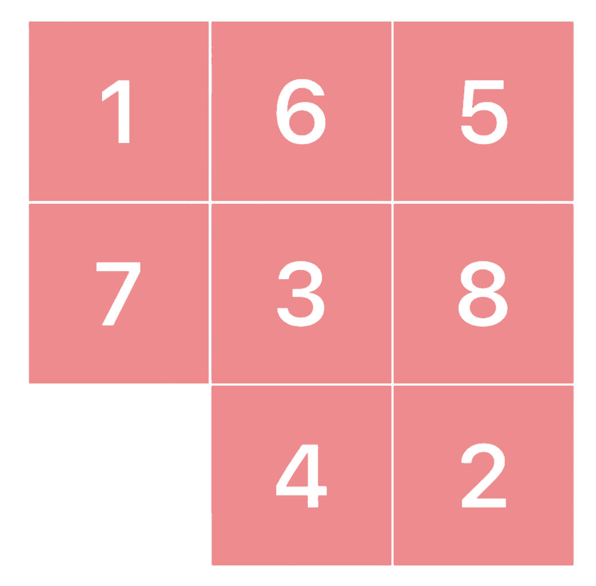

# 8-Puzzle Problem Solver

## Problem Description

The 8-Puzzle is a classic problem in artificial intelligence, involving a 3x3 grid with eight numbered tiles and one empty space. The objective is to rearrange the tiles from a given initial configuration to a specified goal state by sliding the tiles into the empty space. The problem components include the initial state, goal state, possible actions, transition model, goal test, and path cost.

<div align="center">
    
</div>

### Problem Components:

- **Tiles**: Eight numbered tiles labeled 1 through 8 and an empty space (represented by 0).
- **Initial State**: The starting configuration of the puzzle.
- **Goal State**: The desired configuration where tiles are arranged in ascending order with the empty space in the bottom-right corner.
- **Actions**: Moving a tile adjacent to the empty space into the empty space.
- **Transition Model**: Rules governing state changes when actions are applied.
- **Goal Test**: Determines whether a state matches the goal state.
- **Path Cost**: Cost associated with each action.

## Available Methods:

- A_star
- DFS
- BFS
- IDS
- UCS

## Project Overview

This project implements a solver for the 8-Puzzle problem using various search algorithms in Python. It includes functions for A* search, Depth-First Search (DFS), Breadth-First Search (BFS), Iterative Deepening Depth-First Search (IDS), and Uniform Cost Search (UCS). Additionally, the project provides visualization and debugging functionalities.

### Solution Code Components:

1. **Initial Setup**: Define goal state, helper functions for actions, state representation, and heuristic calculations.
2. **Search Algorithms**: Implement A*, DFS, BFS, IDS, and UCS algorithms.
3. **Solution Output**: Functions to generate and visualize the solution path.
4. **Debugging Support**: Enable debug mode to visualize intermediate steps and debug the code.

### How to Use:

1. **Input**: Provide the initial state of the puzzle as a 3x3 numpy array.
2. **Choose Algorithm**: Select the desired search algorithm from the available options.
3. **Execute Code**: Run the provided functions with the initial state and chosen algorithm to obtain the solution.
4. **Debugging**: Enable debug mode to visualize intermediate steps and debug the code if needed.

## Example Usage:

```python
import numpy as np

# Define initial state
start_puzzle = np.array([1, 2, 3, 0, 7, 6, 5, 4, 8]).reshape(3, 3)

# Choose algorithm (e.g., DFS)
solution, execution_time, memory_peak = solve(start_puzzle, Methods.DFS, debug=True)

# Print solution, execution time, and memory peak
print("Solution:", solution)
print("Execution Time:", execution_time)
print("Memory Peak:", memory_peak)
```

## Note:

- Debug mode provides additional information during execution for debugging purposes.
- Ensure numpy and pandas libraries are installed to run the code successfully.